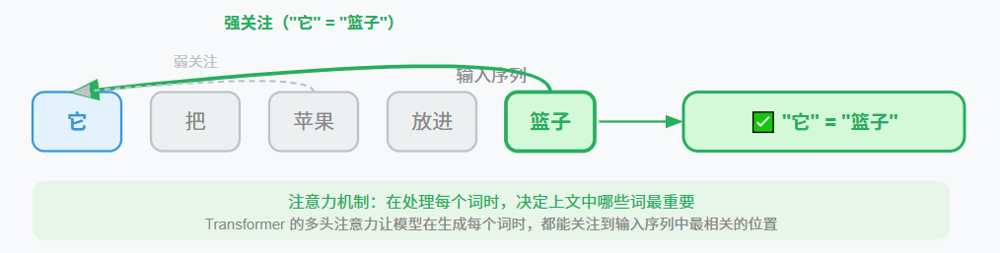

# 1、LLM与Agent演进
AI与人类的交互方式经历了一段漫长而精彩的演进旅程，从开始的基于预设规则的聊天机器人，发展到基于NLP（自然语言处理）技术催生的意图识别智能对话系统，实现由开发者提前定义更灵活的机器人。

Transformer架构的神经网络在2017年被提出后，大语言模型（LLM）的迅速爆发，为人工智能带来了划时代的变革，它以自然语言为输入，不再依赖预定义的意图。通过自然语言描述让模型生成答复。

Transformer架构之前，如RNN、LSTM等网络模型对语义的理解是沿着单词串行传递，累积过程会随着序列长度的增加而显著降低，就像从左到右逐字阅读文章，当遇到长句子时就容易出现边读边忘。Transformer引入Attention机制，实现对语义的理解在不同词之间的相关性上，不会随序列长度的增加而下降，让模型能同时纵览全局。用一个比喻来理解注意力机制： 想象你在读这句话——"她把苹果放进篮子，然后拿走了它。"
"它"指的是什么？你的大脑会自动"关注"前文中的"篮子"（而不是"苹果"）。Transformer 在工程实现上，将其巧妙地转化为一个类似数据库查询的系统：

- Query (查询 Q)：当前正在处理的词（“它”）主动发出的寻呼信号。
- Key (键 K)：上文中所有词挂在自己身上的标签（“我是苹果”、“我是篮子”）。
- Value (值 V)：这些词真正的深层语义内容。

当前词的 Q 会去和上文所有词的 K 进行向量点积计算。匹配度越高，对应词的 V 就会以极大的比重融入到当前词的理解中。

为了捕捉全方位的联系，模型同时运行多套注意力机制（多头注意力 Multi-Head Attention），有的头负责找动宾搭配，有的头负责找代词还原。这种对上下文的极致榨取，构成了Agent理解复杂Prompt的底层基础。

而智能体(Agent)时代的到来，就是在大语言模型(LLM)强大的理解和推理能力的基础上，增加行动能力，不仅能理解你的输入，还能根据输入，理解和决策，并可根据需要选择工具执行，由工具负责连接真实世界，循环机制负责根据反馈继续修正，完成推理实现最终响应。


# 2、Agent的核心架构与组件
一个基于LLM的Agent系统通常由以下四个核心模块构成，类比一个人的“五官”和“大脑”：
- 大脑 (Brain/LLM)人的大脑：核心调度器，负责逻辑推理、意图识别与决策。
- 规划模块 (Planning)人的逻辑思维：将复杂目标拆解为可执行的子任务（思维链），并能对过去的行为进行反思和修正。
- 记忆系统 (Memory)人的记忆：包括短期记忆（当前对话上下文）和长期记忆（利用向量数据库存储和检索知识，即RAG）。
- 工具箱 (Tools)人的手和脚：通过API调用外部工具（如搜索、代码解释器），使智能体能影响数字乃至物理世界。

从根本上说，一个Agent系统是由智能体（Agent） 和环境（Environment） 共同组成的一个整体。智能体在这个环境中通过“感知-决策-行动”的循环来达成目标。它是一种能自主感知环境、进行决策并执行行动以实现特定目标的智能实体。与传统的自动化程序不同，Agent的核心在于其自主性和目标导向性。
- 基本循环：当前最主流的LLM Agent系统遵循一个简单的“推理+工具”循环：
- 感知与推理：大模型（LLM）作为“大脑”接收输入，决定下一步要做什么。
- 行动：模型调用外部工具（如搜索引擎、计算器、API）来执行具体操作。

观察与迭代，获取工具返回的结果，并将其作为新的输入，再次进入推理阶段，直到任务完成。

# 3、LLM模型的本地部署
Ollama 提供了自动检测系统的安装脚本，支持主流 Linux 发行版，本文使用预编译二进制文件从 [Ollama GitHub Releases](https://github.com/ollama/ollama/releases) 下载对应架构的二进制文件（如 ollama-linux-amd64）：
```shell
# 替换为最新版本号（如 v0.1.29）
VERSION="v0.1.29"
curl -L "https://github.com/ollama/ollama/releases/download/${VERSION}/ollama-linux-amd64" -o /usr/local/bin/ollama
chmod +x /usr/local/bin/ollama
```
上述安装完成后，再配置系统服务，创建 systemd 服务文件（适用于 Ubuntu/Debian/Fedora）：
```shell
sudo tee /etc/systemd/system/ollama.service <<EOF
[Unit]
Description=Ollama Service
After=network.target
 
[Service]
ExecStart=/usr/local/bin/ollama serve
User=$USER  # 替换为当前用户（非 root）
Group=$USER
Restart=always
Environment="PATH=/usr/local/sbin:/usr/local/bin:/usr/sbin:/usr/bin:/sbin:/bin"
 
[Install]
WantedBy=multi-user.target
EOF
```
设置ollama服务自启动
```shell
sudo systemctl daemon-reload
sudo systemctl enable --now ollama

```
启动并查看运行状态
```shell
systemctl start ollama
systemctl status ollama
```
若输出 active (running)，表示服务启动成功。
```shell
# 拉取模型到本地
ollama pull qwen3:14b
# 列出本地模型
ollama list
# 预加载本地模型
ollama load qwen3:14b
```
# 4、Agent简单示例

本地模型部署完成后，就可以通过OpenAI的接口调用LLM本地模型来实现Agent的推理操作。不过在代码编写前，还需要先安装OpenAI的python环境，安装指令如下：
```shell
pip install OpenAI
```
OpenAI提供一种自然语言处理API接口completions调用远程或本地部署的LLM（大语言模型）完成如各种文本生成等任务，例如：

- 文本摘要：给定一篇文章，生成一个简短的摘要。
- 语言翻译：将一种语言的文本翻译成另一种语言的文本。
- 文章生成：生成一篇文章，可以用于自动写作、内容创作等领域。
- 问答系统：回答用户提出的问题，可以用于智能客服、知识库等领域。

- 自动化写作：自动生成各种类型的文本，例如广告文案、新闻报道、小说等。

通过调用OpenAI的completions接口，发送远程请求提交向大语言模型处理，实现一个简单智能体应用，需要以下步骤：

1. 使用OpenAI函数创建模型调用的客户端请对象；
2. 使用刚才创建的客户端对象发送请求并获得响应对象；
3. 输出响应结果。

以下代码是一轮Agent请求调用的基本步骤：

```python
from openai import OpenAI

# 1、创建智能体请求客户端
client = OpenAI(api_key="not need", base_url="http://localhost:11434/v1")
# 2、通过客户端向LLM模型发送请求，获取响应
response = client.chat.completions.create(
	model="qwen3:14b", 
	messages=[
		{"role": "system", "content": "你是一个智能助手，可以使用工具来帮助用户解决问题。"},
		{"role": "user", "content": "北京今天天气怎么样？"}
	], 
	tools=[...],
	tool_choice="auto" if self.tools else None
)
# 3、输出响应结果
print(response.choices[0].message)
```
当然，智能体的实现逻辑也可以封装成一个类，通过类的实例来实现，[智能体封装示例](/codes/llmwarpper.py)中已封装了一个请求天气与简单计算智能功能的智能体基类，并实例该类实现天气查询智能体的功能。

该示例中，智能体需要调用用户提供工具函数来获取动态数据，函数调用完成后，需要把函数的返回结果附加到上下文中，再次提交LLM处理。所以使用了循环。同时为了防止死循环的出现设置了循环的最大次数，循环代码如下：

```python
iteration = 0
while iteration < max_tool_iterations: # 调用API
	response = self.client.chat.completions.create(
		model=self.model, 
		messages=messages, 
		tools=self.tools if self.tools else None,
		tool_choice="auto" if self.tools else None
	)
	message = response.choices[0].message
	messages.append(message.model_dump())
	if not auto_execute_tools or not message.tool_calls:  # 检查是否需要调用工具
		return message.content or ""
	for tool_call in message.tool_calls:  # 执行工具调用
		tool_result = self._execute_tool(tool_call.model_dump())
		messages.append({ "role": "tool", "tool_call_id": tool_call.id, "content": tool_result })
	iteration += 1
```
从上述代码可知，除了角色(role)为系统(system)、用户(user)的提示词外，循环中还会累加请求响应与一个角色为工具(tool)的响应到信息(messag)列表中，也就是说每循环一次，请求提交的内容就会多出一部分。

而大模型的计算过程所消耗的算力是用词元(token)来统计的，一般情况下，一个汉字对应 1.5 到 2 个词元（Token），所以当遇到复杂逻辑，需要多次循环来请求多个工具函数时，消耗的词元就会大增。